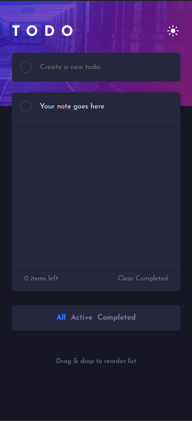
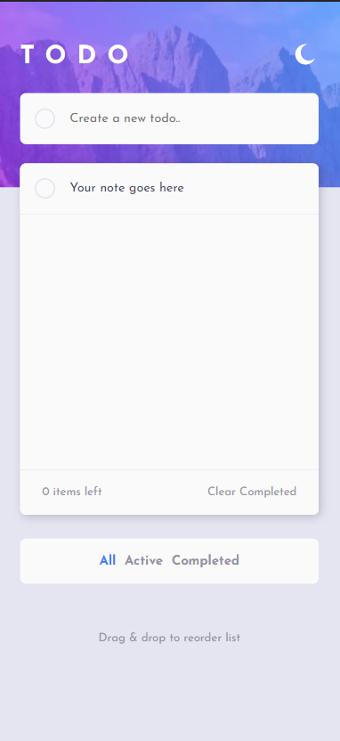
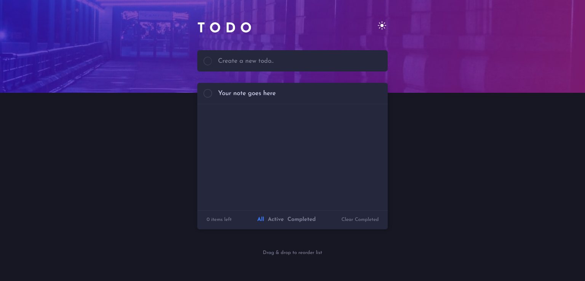
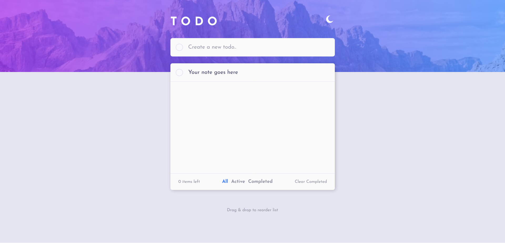

# Frontend Mentor - Todo app solution

This is a solution to the [Todo app challenge on Frontend Mentor](https://www.frontendmentor.io/challenges/todo-app-Su1_KokOW).

## Table of contents

- [Overview](#overview)
  - [The challenge](#the-challenge)
  - [Screenshot](#screenshot)
  - [Links](#links)
- [Built with](#built-with)
- [Continious development](#continued-development)
- [Author](#author)

## Overview

A TODO App to make your day more productive!

### The challenge

Users should be able to:

- View the optimal layout for the app depending on their device's screen size
- See hover states for all interactive elements on the page
- Add new todos to the list
- Mark todos as complete
- Delete todos from the list
- Filter by all/active/complete todos
- Clear all completed todos
- Toggle light and dark mode
- **Bonus**: Drag and drop to reorder items on the list

### Screenshot

### Links

- Solution URL: [Add solution URL here](https://your-solution-url.com)
- Live Site URL: [Add live site URL here](https://kashish-d.github.io/ToDoApp/)

### Built with

- Semantic HTML5 markup
- CSS custom properties
- Flexbox
- CSS Grid
- Mobile-first workflow
- Vanilla Js

### Continued development

- Will be implementing
 - ordering tasks by drag and drop.

## Author

- Name - [Kashish Dhingra]
- Frontend Mentor - [@kashish-d](https://www.frontendmentor.io/profile/kashish-d)
- Twitter - [@Kashish_web_dev](https://twitter.com/Kashish_web_dev)
